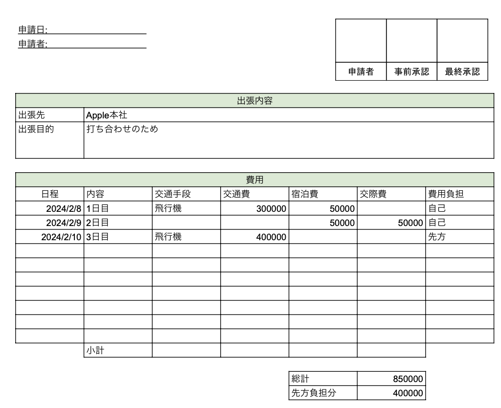
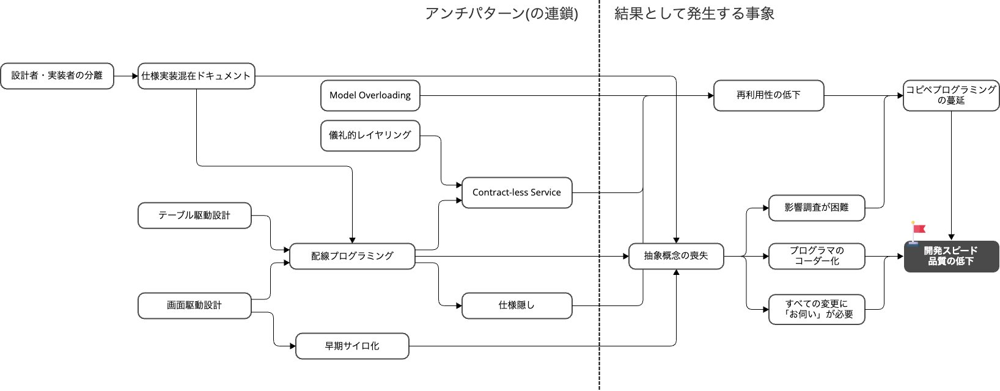
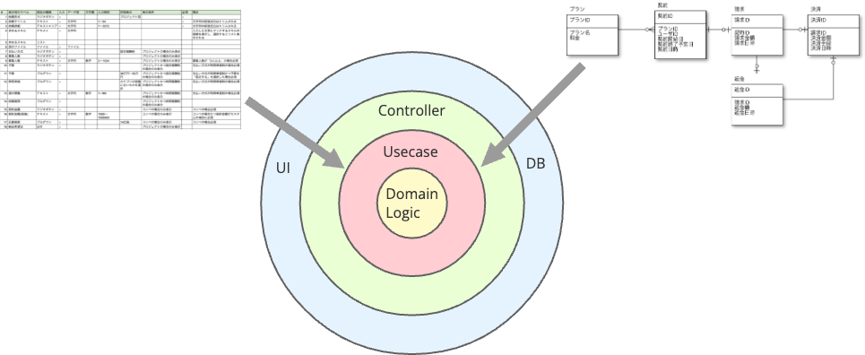

# 「なんとなく設計」から 抜け出すための モデリング入門

kawasima

---

## 例題

- 出張予定費用が10万円以上または、出張申請者が役職なしの場合は、上長の事前承認が必要である
- 出張費用負担を先方が持ってくれる場合は、費用負担区分を「先方」に設定する。この場合、金額および出張者の役職に関わらず事前承認が必要である
- 出張申請を提出した時点で、事前承認が必要かどうかを判定し、必要ならば上長に事前承認を依頼する
- 出張後に上長がその内容および金額を最終承認し、立て替えた金額を経理に連携する



---

ニューレガシーアンチパターン



[ニューレガシーアンチパターン](https://scrapbox.io/kawasima/%E3%83%8B%E3%83%A5%E3%83%BC%E3%83%AC%E3%82%AC%E3%82%B7%E3%83%BC%E3%82%A2%E3%83%B3%E3%83%81%E3%83%91%E3%82%BF%E3%83%BC%E3%83%B3)
---

## テーブル駆動設計

| **カラム名** | **型** | **NULL許可** | **説明** |
| --- | --- | --- | --- |
| 申請ID | VARCHAR(50) | NOT NULL | 出張申請の一意識別子(PK) |
| 申請ステータス | VARCHAR(20) | NOT NULL | 下書き/提出済み/事前承認待ち/事前承認済み/実施済み/精算完了 |
| 申請者社員番号 | VARCHAR(20) | NOT NULL | 申請者の社員番号 |
| 申請者氏名 | VARCHAR(100) | NOT NULL | 申請者の氏名 |
| 申請者役職 | VARCHAR(50) | NULL | 申請者の役職(NULLは役職なし) |
| 出張目的 | VARCHAR(500) | NULL | 出張の目的 |
| 出張開始日 | DATE | NULL | 出張期間の開始日 |
| 出張終了日 | DATE | NULL | 出張期間の終了日 |
| 予定交通費 | INT | NULL | 予定交通費(円) |
| 予定宿泊費 | INT | NULL | 予定宿泊費(円) |
| 予定日当 | INT | NULL | 予定日当(円) |
| 予定費用合計 | INT | NULL | 予定費用の合計(円) |
| 費用負担区分 | VARCHAR(10) | NULL | 自社負担/先方負担 |
| 事前承認要否フラグ | CHAR(1) | NULL | 0:不要、1:必要 |
| 申請日時 | TIMESTAMP | NULL | 出張申請を提出した日時 |
| 事前承認依頼日時 | TIMESTAMP | NULL | 上長に事前承認を依頼した日時 |
| 事前承認者社員番号 | VARCHAR(20) | NULL | 事前承認を行った上長の社員番号 |
| 事前承認者氏名 | VARCHAR(100) | NULL | 事前承認を行った上長の氏名 |
| 事前承認日時 | TIMESTAMP | NULL | 事前承認された日時 |
| 出張実施報告日時 | TIMESTAMP | NULL | 出張実施を報告した日時 |
| 実費交通費 | INT | NULL | 実費交通費(円) |
| 実費宿泊費 | INT | NULL | 実費宿泊費(円) |
| 実費日当 | INT | NULL | 実費日当(円) |
| 実費合計 | INT | NULL | 実費の合計(円) |
| 最終承認者社員番号 | VARCHAR(20) | NULL | 最終承認を行った上長の社員番号 |
| 最終承認者氏名 | VARCHAR(100) | NULL | 最終承認を行った上長の氏名 |
| 最終承認日時 | TIMESTAMP | NULL | 最終承認された日時 |
| 経理連携日時 | TIMESTAMP | NULL | 経理システムへ連携した日時 |
| 経理連携フラグ | CHAR(1) | NULL | 0:未連携、1:連携済み |
| 備考 | VARCHAR(1000) | NULL | 備考欄 |
| 作成日時 | TIMESTAMP | NOT NULL | レコード作成日時 |
| 更新日時 | TIMESTAMP | NOT NULL | レコード最終更新日時 |

---

## ノー抽象

```java
// 出張申請の送信処理
public void submitBusinessTrip(BusinessTripRequest request) {
  // 事前承認が必要かどうかを判定
  boolean requiresPreApproval = false;
  
  if (request.getEstimatedCost() >= 100000 || request.getPosition() == null) {
    requiresPreApproval = true;
  }
  
  if ("先方".equals(request.getCostBearingType())) {
    requiresPreApproval = true;
  }
  
  // データベースに保存
  BusinessTrip businessTrip = new BusinessTrip();
  businessTrip.setRequiresPreApproval(requiresPreApproval);
  businessTrip.setStatus(requiresPreApproval ? "PENDING_PRE_APPROVAL" : "SUBMITTED");
  // その他のrequestフィールドをコピー
  
  businessTripRepository.save(businessTrip);
  
  // 事前承認が必要なら上長に依頼
  if (requiresPreApproval) {
    sendPreApprovalRequest(request.getManagerId());
  }
}
```

---

## なんとなく設計

流石にそうは作らんやろ、とレイヤーに整理してみたところで本質は何も変わらない。

### Web層

```java
// コントローラー
@RestController
@RequestMapping("/api/business-trips")
public class BusinessTripController {
  private SubmitBusinessTripUseCase submitBusinessTripUseCase;
  
  @PostMapping("/submit")
  public ResponseEntity<Void> submit(@RequestBody BusinessTripRequest request) {
    // リクエストをエンティティに変換
    BusinessTrip businessTrip = new BusinessTrip();
    businessTrip.setEstimatedCost(request.getEstimatedCost());
    businessTrip.setPosition(request.getPosition());
    businessTrip.setCostBearingType(request.getCostBearingType());
    businessTrip.setManagerId(request.getManagerId());
    
    submitBusinessTripUseCase.execute(businessTrip);
    
    return ResponseEntity.ok().build();
  }
}

// リクエストDTO
public class BusinessTripRequest {
  private int estimatedCost;
  private String position;
  private String costBearingType;
  private String managerId;
  
  // getters/setters
}

// リポジトリインターフェース
public interface BusinessTripRepository {
  void save(BusinessTripEntity entity);
}
```

### ユースケース層

```java
public class SubmitBusinessTripUseCase {
  private BusinessTripRepository businessTripRepository;
  
  public void execute(BusinessTrip request) {
    // 事前承認が必要かどうかを判定
    boolean requiresPreApproval = false;
    
    if (request.getEstimatedCost() >= 100000 || request.getPosition() == null) {
      requiresPreApproval = true;
    }
    
    if ("先方".equals(request.getCostBearingType())) {
      requiresPreApproval = true;
    }
    
    // データベースに保存
    BusinessTripEntity entity = new BusinessTripEntity();
    entity.setEstimatedCost(request.getEstimatedCost());
    entity.setPosition(request.getPosition());
    entity.setCostBearingType(request.getCostBearingType());
    entity.setRequiresPreApproval(requiresPreApproval);
    entity.setStatus(requiresPreApproval ? "PENDING_PRE_APPROVAL" : "SUBMITTED");
    
    businessTripRepository.save(entity);
    
    // 事前承認が必要なら上長に依頼
    if (requiresPreApproval) {
      sendPreApprovalRequest(request.getManagerId());
    }
  }
  
  private void sendPreApprovalRequest(String managerId) {
    // 通知処理
  }
}
```

### ドメイン層

```java
public class BusinessTrip {
  private int estimatedCost;
  private String position;
  private String costBearingType;
  private String managerId;
  
  public int getEstimatedCost() { return estimatedCost; }
  public void setEstimatedCost(int estimatedCost) { this.estimatedCost = estimatedCost; }
  public String getPosition() { return position; }
  public void setPosition(String position) { this.position = position; }
  public String getCostBearingType() { return costBearingType; }
  public void setCostBearingType(String costBearingType) { this.costBearingType = costBearingType; }
  public String getManagerId() { return managerId; }
  public void setManagerId(String managerId) { this.managerId = managerId; }
}
```

### インフラ層

```java
@Repository
public class JpaBusinessTripRepository implements BusinessTripRepository {
  @Autowired
  private SpringDataBusinessTripRepository springRepository;
  
  @Override
  public void save(BusinessTripEntity entity) {
    springRepository.save(entity);
  }
}

// Spring Data JPA Repository
interface SpringDataBusinessTripRepository extends JpaRepository<BusinessTripEntity, String> {}

// データベースエンティティ
@Entity
@Table(name = "business_trips")
public class BusinessTripEntity {
  @Id
  private String id;
  private String status;
  private boolean requiresPreApproval;
  private int estimatedCost;
  private String position;
  private String costBearingType;
  
  // getters/setters のみ
}
```

---

## アウトサイドイン

アウトサイドインな開発は外側の設計で力尽きることが多い。
(というより実態は外側の設計が終わったら1人の担当者に渡されるので人による)



勝手な工夫は許されない現場が多いので、配線プログラミングになりがち。


---

## 仕様モデル

あえて仕様を書いてみる

```domain
data 出張申請 = 申請ステータス
  AND 申請者名
  AND 出張目的
  AND 出張期間
  AND 費用負担区分
  AND 金額
  
data 費用負担区分 = 自社負担 OR 先方負担

data 申請ステータス = 下書き
  OR 提出済み
  OR 事前承認待ち
  OR 事前承認済み
  OR 最終承認待ち
  OR 精算完了

behavior 申請提出する = 出張申請 -> 出張申請
// 10万円以上または役職なし、または先方負担の費目が含まれる場合
behavior 上長が事前承認する = 出張申請 -> 出張申請
behavior 最終承認する = 出張申請 -> 出張申請
behavior 経理に連携する = 出張申請 -> 出張申請
```

[ドメイン記述ミニ言語](https://scrapbox.io/kawasima/%E3%83%89%E3%83%A1%E3%82%A4%E3%83%B3%E8%A8%98%E8%BF%B0%E3%83%9F%E3%83%8B%E8%A8%80%E8%AA%9E)

### 問題点

- どの状態の時にどの振る舞いが適用できるか不明

その状態で実装に突入するので、各画面設計者ごとに

---

## 要求から実装へのジャンプ

- 要求を文書化し…
- 画面項目を設計し…
- テーブルを設計し…
- それらを繋ぐようにコードを書き始める

---

## インサイドアウト


---

## 仕様モデルに求める条件

- 振る舞いが全域性を満たすこと
- 振る舞いに渡すデータが
- 振る舞いが単一責務であること

### 仕様モデルは「言語」である

語彙だけでなく文法や意味論を作り上げてこその**ユビキタス言語**
