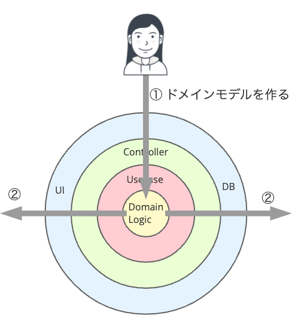

# 「なんとなく設計」から 抜け出すための モデリング入門

kawasima

---

## 前提となる資料

- [ニューレガシーアンチパターン](https://scrapbox.io/kawasima/%E3%83%8B%E3%83%A5%E3%83%BC%E3%83%AC%E3%82%AC%E3%82%B7%E3%83%BC%E3%82%A2%E3%83%B3%E3%83%81%E3%83%91%E3%82%BF%E3%83%BC%E3%83%B3)
- [生成AI時代のドメインモデリング ― OOPとFPを超えて](https://umtp-japan.org/event-seminar/mf2025/76554)

---

## 例題

- 出張予定費用が10万円以上または、出張申請者が役職なしの場合は、上長の事前承認が必要である
- 出張費用負担を先方が持ってくれる場合は、費用負担区分を「先方」に設定する。この場合、金額および出張者の役職に関わらず事前承認が必要である
- 出張申請を提出した時点で、事前承認が必要かどうかを判定し、必要ならば上長に事前承認を依頼する
- 出張後に上長がその内容および金額を最終承認し、立て替えた金額を経理に連携する


---

## ニューレガシーアンチパターン


---

## テーブル駆動設計

| **カラム名** | **型** | **NULL許可** | **説明** |
| --- | --- | --- | --- |
| 申請ID | VARCHAR(50) | NOT NULL | 出張申請の一意識別子(PK) |
| 申請ステータス | VARCHAR(20) | NOT NULL | 下書き/提出済み/事前承認待ち/事前承認済み/実施済み/精算完了 |
| 申請者社員番号 | VARCHAR(20) | NOT NULL | 申請者の社員番号 |
| 申請者氏名 | VARCHAR(100) | NOT NULL | 申請者の氏名 |
| 申請者役職 | VARCHAR(50) | NULL | 申請者の役職(NULLは役職なし) |
| 出張目的 | VARCHAR(500) | NULL | 出張の目的 |
| 出張開始日 | DATE | NULL | 出張期間の開始日 |
| 出張終了日 | DATE | NULL | 出張期間の終了日 |
| 予定交通費 | INT | NULL | 予定交通費(円) |
| 予定宿泊費 | INT | NULL | 予定宿泊費(円) |
| 予定日当 | INT | NULL | 予定日当(円) |
| 予定費用合計 | INT | NULL | 予定費用の合計(円) |
| 費用負担区分 | VARCHAR(10) | NULL | 自社負担/先方負担 |
| 事前承認要否フラグ | CHAR(1) | NULL | 0:不要、1:必要 |
| 申請日時 | TIMESTAMP | NULL | 出張申請を提出した日時 |
| 事前承認依頼日時 | TIMESTAMP | NULL | 上長に事前承認を依頼した日時 |
| 事前承認者社員番号 | VARCHAR(20) | NULL | 事前承認を行った上長の社員番号 |
| 事前承認者氏名 | VARCHAR(100) | NULL | 事前承認を行った上長の氏名 |
| 事前承認日時 | TIMESTAMP | NULL | 事前承認された日時 |
| 出張実施報告日時 | TIMESTAMP | NULL | 出張実施を報告した日時 |
| 実費交通費 | INT | NULL | 実費交通費(円) |
| 実費宿泊費 | INT | NULL | 実費宿泊費(円) |
| 実費日当 | INT | NULL | 実費日当(円) |
| 実費合計 | INT | NULL | 実費の合計(円) |
| 最終承認者社員番号 | VARCHAR(20) | NULL | 最終承認を行った上長の社員番号 |
| 最終承認者氏名 | VARCHAR(100) | NULL | 最終承認を行った上長の氏名 |
| 最終承認日時 | TIMESTAMP | NULL | 最終承認された日時 |
| 経理連携日時 | TIMESTAMP | NULL | 経理システムへ連携した日時 |
| 経理連携フラグ | CHAR(1) | NULL | 0:未連携、1:連携済み |
| 備考 | VARCHAR(1000) | NULL | 備考欄 |
| 作成日時 | TIMESTAMP | NOT NULL | レコード作成日時 |
| 更新日時 | TIMESTAMP | NOT NULL | レコード最終更新日時 |

---

## ノー抽象

```java
// 出張申請の送信処理
public void submitBusinessTrip(BusinessTripRequest request) {
  // 事前承認が必要かどうかを判定
  boolean requiresPreApproval = false;
  
  if (request.getEstimatedCost() >= 100000 || request.getPosition() == null) {
    requiresPreApproval = true;
  }
  
  if ("先方".equals(request.getCostBearingType())) {
    requiresPreApproval = true;
  }
  
  // データベースに保存
  BusinessTrip businessTrip = new BusinessTrip();
  businessTrip.setRequiresPreApproval(requiresPreApproval);
  businessTrip.setStatus(requiresPreApproval ? "PENDING_PRE_APPROVAL" : "SUBMITTED");
  // その他のrequestフィールドをコピー
  
  businessTripRepository.save(businessTrip);
  
  // 事前承認が必要なら上長に依頼
  if (requiresPreApproval) {
    sendPreApprovalRequest(request.getManagerId());
  }
}
```

---

## なんとなく設計

流石にそうは作らんやろ、とレイヤーに整理してみたところで本質は何も変わらない。

### Web層

```java
// コントローラー
@RestController
@RequestMapping("/api/business-trips")
public class BusinessTripController {
  private SubmitBusinessTripUseCase submitBusinessTripUseCase;
  
  @PostMapping("/submit")
  public ResponseEntity<Void> submit(@RequestBody BusinessTripRequest request) {
    // リクエストをエンティティに変換
    BusinessTrip businessTrip = new BusinessTrip();
    businessTrip.setEstimatedCost(request.getEstimatedCost());
    businessTrip.setPosition(request.getPosition());
    businessTrip.setCostBearingType(request.getCostBearingType());
    businessTrip.setManagerId(request.getManagerId());
    
    submitBusinessTripUseCase.execute(businessTrip);
    
    return ResponseEntity.ok().build();
  }
}

// リクエストDTO
public class BusinessTripRequest {
  private int estimatedCost;
  private String position;
  private String costBearingType;
  private String managerId;
  
  // getters/setters
}

// リポジトリインターフェース
public interface BusinessTripRepository {
  void save(BusinessTripEntity entity);
}
```

### ユースケース層

```java
public class SubmitBusinessTripUseCase {
  private BusinessTripRepository businessTripRepository;
  
  public void execute(BusinessTrip request) {
    // 事前承認が必要かどうかを判定
    boolean requiresPreApproval = false;
    
    if (request.getEstimatedCost() >= 100000 || request.getPosition() == null) {
      requiresPreApproval = true;
    }
    
    if ("先方".equals(request.getCostBearingType())) {
      requiresPreApproval = true;
    }
    
    // データベースに保存
    BusinessTripEntity entity = new BusinessTripEntity();
    entity.setEstimatedCost(request.getEstimatedCost());
    entity.setPosition(request.getPosition());
    entity.setCostBearingType(request.getCostBearingType());
    entity.setRequiresPreApproval(requiresPreApproval);
    entity.setStatus(requiresPreApproval ? "PENDING_PRE_APPROVAL" : "SUBMITTED");
    
    businessTripRepository.save(entity);
    
    // 事前承認が必要なら上長に依頼
    if (requiresPreApproval) {
      sendPreApprovalRequest(request.getManagerId());
    }
  }
  
  private void sendPreApprovalRequest(String managerId) {
    // 通知処理
  }
}
```

### ドメイン層

```java
public class BusinessTrip {
  private int estimatedCost;
  private String position;
  private String costBearingType;
  private String managerId;
  
  public int getEstimatedCost() { return estimatedCost; }
  public void setEstimatedCost(int estimatedCost) { this.estimatedCost = estimatedCost; }
  public String getPosition() { return position; }
  public void setPosition(String position) { this.position = position; }
  public String getCostBearingType() { return costBearingType; }
  public void setCostBearingType(String costBearingType) { this.costBearingType = costBearingType; }
  public String getManagerId() { return managerId; }
  public void setManagerId(String managerId) { this.managerId = managerId; }
}
```

### インフラ層

```java
@Repository
public class JpaBusinessTripRepository implements BusinessTripRepository {
  @Autowired
  private SpringDataBusinessTripRepository springRepository;
  
  @Override
  public void save(BusinessTripEntity entity) {
    springRepository.save(entity);
  }
}

// Spring Data JPA Repository
interface SpringDataBusinessTripRepository extends JpaRepository<BusinessTripEntity, String> {}

// データベースエンティティ
@Entity
@Table(name = "business_trips")
public class BusinessTripEntity {
  @Id
  private String id;
  private String status;
  private boolean requiresPreApproval;
  private int estimatedCost;
  private String position;
  private String costBearingType;
  
  // getters/setters のみ
}
```

---

## アウトサイドイン

アウトサイドインな開発は外側の設計で力尽きることが多い。
(というより実態は外側の設計が終わったら1人の担当者に渡されるので人による)


勝手な工夫は許されない現場が多いので、配線プログラミングになりがち。


---

## ドメインモデルのレベル

ドメインモデルには3つのレベルがある

- 概念モデル
  実世界における関心のある状況を記述する
- 仕様モデル
  ソフトウェアシステムが何をしなければならないか、どのような情報を保持しなければならないか、そしてどのような振る舞いを示さなければならないかを定義する
- 実装モデル
  コンピューティング環境の全ての制約と限界を考慮して、ソフトウェアがどのように実装されるかを記述する

https://martinfowler.com/ieeeSoftware/purpose.pdf

---

## 仕様ドメインモデルの構成要素

ソフトウェアシステムが何をしなければならないか、どのような**情報を保持**しなければならないか、そしてどのような**振る舞い**を示さなければならないかを定義する

つまり仕様ドメインモデルは、高次の抽象レベルで記述された業務の

- データ
- 振る舞い

で構成される

---

## 仕様モデルの書き方

『関数型ドメインモデリング』に載っているドメイン記述ミニ言語をベースに仕様モデルの書き方を定めています。

→ [ドメイン記述ミニ言語](https://scrapbox.io/kawasima/%E3%83%89%E3%83%A1%E3%82%A4%E3%83%B3%E8%A8%98%E8%BF%B0%E3%83%9F%E3%83%8B%E8%A8%80%E8%AA%9E)

---

## アウトサイドイン開発の仕様モデル

```domain
data 出張申請 = 申請ステータス
  AND 申請者社員番号
  AND 申請者氏名
  AND 申請者役職
  AND 出張目的
  AND 出張先
  AND 出張期間開始日
  AND 出張期間終了日
  AND 出張者リスト
  AND 予定交通費
  AND 予定宿泊費
  AND 予定日当
  AND 予定その他費用
  AND 予定費用合計
  AND 費用負担区分
  AND 事前承認要否
  AND 申請日時
  AND 事前承認者社員番号
  AND 事前承認日時
  AND 事前承認コメント
  AND 実費交通費
  AND 実費宿泊費
  AND 実費日当
  AND 実費その他費用
  AND 実費合計
  AND 出張報告日時
  AND 最終承認者社員番号
  AND 最終承認日時
  AND 最終承認コメント
  AND 経理連携日時
  
data 費用負担区分 = 自社負担 OR 先方負担

data 申請ステータス = 下書き
  OR 提出済み
  OR 事前承認待ち
  OR 事前承認済み
  OR 実施済み
  OR 精算完了

behavior 申請提出する = 出張申請 -> 出張申請
// 10万円以上または役職なし、または先方負担の費目が含まれる場合
behavior 上長が事前承認する = 出張申請 -> 出張申請
behavior 最終承認する = 出張申請 -> 出張申請
behavior 経理に連携する = 出張申請 -> 出張申請
```

---

## インサイドアウト



インサイドアウト開発で先に仕様モデルを書くことを考えよう。

---

## 良い仕様モデルに求める条件

- 仕様レベルで抽象概念を作る(手続き抽象とデータ抽象)
- データの不変条件が一意に定まること
  - 「区分〇〇の時だけ××は必須」みたいな分岐がないこと
- 振る舞いが全域性を満たすこと
- 振る舞いがスタンプ結合でない
  - 振る舞いで使わないデータを入力としない
- 振る舞いが単一責務であること

### 仕様モデルは「言語」である

語彙だけでなく文法や意味論を作り上げてこその**ユビキタス言語**

---

## 手続き抽象

実装の詳細を知らなくても、その振る舞いが提供する機能を利用できる

```java
// 手続き抽象を用いた出張申請の送信処理
public void submitBusinessTrip(BusinessTripRequest request) {
  // 事前承認が必要かどうかをチェックする
  boolean requiresPreApproval = checkPreApprovalRequired(request);
  
  // 出張申請をデータベースに保存する
  saveBusinessTrip(request, requiresPreApproval);
  
  // もし事前承認が必要な場合は、上長に承認依頼を送る
  if (requiresPreApproval) {
    requestPreApproval(request.getManagerId());
  }
}

// 事前承認が必要かどうかを判定する
private boolean checkPreApprovalRequired(BusinessTripRequest request) {
  // 高額な出張かどうか
  if (isHighCostTrip(request)) {
    return true;
  }
  
  // 役職なしの社員かどうか
  if (isNonManagerialPosition(request)) {
    return true;
  }
  
  // 先方負担かどうか
  if (isCounterpartyBearing(request)) {
    return true;
  }
  
  return false;
}

// 出張費用が10万円以上かどうかをチェックする関数
private boolean isHighCostTrip(BusinessTripRequest request) {
  return request.getEstimatedCost() >= 100000;
}

// 申請者が役職なしかどうかをチェックする関数
private boolean isNonManagerialPosition(BusinessTripRequest request) {
  return request.getPosition() == null;
}

// 費用負担が「先方」かどうかをチェックする関数
private boolean isCounterpartyBearing(BusinessTripRequest request) {
  return "先方".equals(request.getCostBearingType());
}
```

---

### データ抽象

対象データの詳細を知らなくても、そのデータに対しての振る舞いを実行できる

```java
// データ抽象の例：仕様と実装の分離
// 利用者に公開されるのは「操作の仕様」のみで、データの内部構造は隠蔽される
interface BusinessTrip {
  boolean requiresPreApproval();
}

class BusinessTripImpl implements BusinessTrip {
  private final int estimatedCost;
  private final String position;
  private final String costBearingType;

  public BusinessTripImpl(int estimatedCost, String position, String costBearingType) {
    this.estimatedCost = estimatedCost;
    this.position = position;
    this.costBearingType = costBearingType;
  }

  @Override
  public boolean requiresPreApproval() {
    return estimatedCost >= 100000 || 
           position == null || 
           "先方".equals(costBearingType);
  }
}

class BusinessTripFactory {
  public static BusinessTrip createBusinessTrip(BusinessTripRequest request) {
    return new BusinessTripImpl(
      request.getEstimatedCost(),
      request.getPosition(),
      request.getCostBearingType()
    );
  }
}

// 利用側のコード
BusinessTripRequest request = new BusinessTripRequest();
request.setEstimatedCost(150000);
request.setPosition("Member");
request.setCostBearingType("Self");

BusinessTrip trip = BusinessTripFactory.createBusinessTrip(request);

// 利用者は「事前承認が必要か」を問うことはできるが、
// 内部の estimatedCost を直接参照したり変更したりすることはできない
if (trip.requiresPreApproval()) {
   // ...
}
```

データ抽象は雑なクラス設計だと壊れやすい (カプセル化の破れ)

---

## 振る舞いの全域性

```domain
behavior 申請提出する = 出張申請 -> 出張申請
// 10万円以上または役職なし、または先方負担の費目が含まれる場合
behavior 上長が事前承認する = 出張申請 -> 出張申請
behavior 最終承認する = 出張申請 -> 出張申請
behavior 経理に連携する = 出張申請 -> 出張申請
```

例えば、これらの振る舞いはどんな状態の出張申請でも適用できる訳ではない。

```domain
behavior 申請提出する = 出張申請ドラフト -> 申請済み出張申請
// 10万円以上または役職なし、または先方負担の費目が含まれる場合
behavior 上長が事前承認する = 申請済み出張申請 -> 事前承認済み出張申請
behavior 最終承認する = ??? -> 最終承認済み出張申請
behavior 経理に連携する = 最終承認済み出張申請 -> 経費連携済み出張申請

data 出張申請 = 出張申請ドラフト
  OR 申請済み出張申請
  OR 事前承認済み出張申請
  OR 最終承認済み出張申請
  OR 経費連携済み出張申請
```

最終承認は何に対して実行するの?
出張実績の登録が漏れているのでは?

```domain
behavior 申請提出する = 出張申請ドラフト -> 申請済み出張申請
// 10万円以上または役職なし、または先方負担の費目が含まれる場合
behavior 上長が事前承認する = 申請済み出張申請 -> 事前承認済み出張申請
behavior 出張実績を登録する = 申請済み出張申請 OR 事前承認済み出張申請 -> 出張実績登録済み出張申請
behavior 最終承認する = 出張実績登録済み出張申請 -> 最終承認済み出張申請
behavior 経理に連携する = 最終承認済み出張申請 -> 経費連携済み出張申請

data 出張申請 = 出張申請ドラフト
  OR 申請済み出張申請
  OR 事前承認済み出張申請
  OR 最終承認済み出張申請
  OR 出張実績登録済み出張申請
  OR 経費連携済み出張申請
```

事前承認は全ての申請済み出張申請に対して実行するわけではない。

```domain
behavior 高額出張かどうか判断する = 出張予定 -> 高額出張 OR　通常出張

behavior 透明性チェック必要な出張かどうか判断する = 出張予定 -> 透明性チェック必要出張 OR 通常出張

data 事前承認OK = 出張申請
  AND 事前承認者
  AND 承認日時

behavior 事前承認が必要か判断する = 出張申請 -> 事前承認必要な出張申請 OR 事前承認不要な出張申請
```

と、全域性を追求していくと「高額出張」や「透明性チェック必要出張」が洗い出される。

これがデータ抽象の本質で、何で「高額出張」や「透明性チェック必要出張」か知らなくても事前承認ルートに入れる。

---

## スタンプ結合を無くす

そもそも出張申請の状態が変わっていっているのか?
事前承認は出張予定に対して行うし、最終承認は出張実績に対して行う。

```domain
data 費目 = 交通費
  OR 宿泊費
  OR 交際費

data 出張予定日程 = 出張予定日付
  AND 費目
  AND 予定金額

data 出張予定費用 = List<出張予定日程>

data 出張予定 = 出張目的
  AND 出張期間
  AND List<出張者>
  AND 出張予定費用

data 出張申請 = 出張予定
  AND 申請者
  AND 申請日時

data 出張実績日程 = 出張実績日付
  AND 費目
  AND 実績金額

data 出張実績費用 = List<出張実績日程>

data 出張実績 = 出張予定
  AND 出張実績費用
```

と巨大なデータのままではなく分解される。

---

## 振る舞いは単一責務であること

SOLIDの原則のSRPは曖昧すぎる。

おすすめは、[命名のプロセス](https://scrapbox.io/kawasima/%E5%91%BD%E5%90%8D%E3%81%AE%E3%83%97%E3%83%AD%E3%82%BB%E3%82%B9) でHonest&Completeな命名をすること。

---

## 仕様モデルの例

```domain
data 社員 = ???
data 出張者 = 社員
data 承認者 = 社員

data 費目 = 交通費
  OR 宿泊費
  OR 交際費

data 出張予定日程 = 出張予定日付
  AND 費目
  AND 予定金額

data 出張予定費用 = List<出張予定日程>

data 出張予定 = 出張目的
  AND 出張期間
  AND List<出張者>
  AND 出張予定費用

data 出張申請 = 出張予定
  AND 申請者
  AND 申請日時

behavior 出張申請する = 出張予定 AND 申請者 AND 申請日時 -> 出張申請

behavior 高額出張かどうか判断する = 出張予定 -> 高額出張 OR　通常出張

behavior 透明性チェック必要な出張かどうか判断する = 出張予定 -> 透明性チェック必要出張 OR 通常出張

data 事前承認OK = 出張申請
  AND 事前承認者
  AND 承認日時

behavior 事前承認が必要か判断する = 出張申請 -> 事前承認必要な出張申請 OR 事前承認不要な出張申請

behavior 上長が事前承認する =  事前承認必要な出張申請 AND 承認者 AND 承認日時 -> 事前承認OK OR 事前承認NG

data 出張実績日程 = 出張実績日付
  AND 費目
  AND 実績金額

data 出張実績費用 = List<出張実績日程>

data 出張実績 = 出張予定
  AND 出張実績費用

behavior 出張実績を登録する = 出張予定 AND 出張実績費用 -> 出張実績

data 最終承認 =　出張実績
  AND 最終承認者
  AND 最終承認日時

data 最終承認する = 出張実績 AND 承認者 -> 最終承認
```

最初の「なんとなく設計」に比べて、曖昧さが減っていることに注目してください。

---

## まとめ

現在、現場で流通しているオブジェクト指向設計やレイヤードアーキテクチャは設計の良し悪しの基準が緩すぎるので、「なんとなく設計」になってしまう。

良い仕様モデルを書くことから始めよう。
